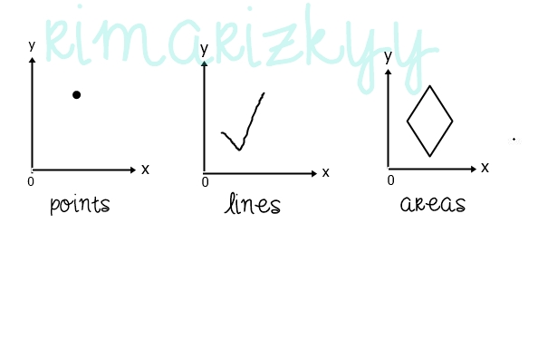
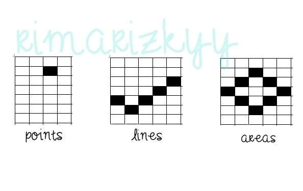

**Data Vektor dan Data Raser**

1. **LATAR BELAKANG MASALAH**

Sistem Informasi Geografis adalah suatu pengenalan hal terhadap data keruangan, biasanya yang dibahas di dalam Sistem Informasi Geografis adalah lokasi suatu obyek. Di dalam SIG ada istilah yaitu Geospasial. Apa itu Geospasial?

Geospasial adalah salah satu aspek dari keruangan suatu obyek yang berada diatas permukaan laut. Data di dalam Geospasial ini terdapat data spasial. Data spasial sendiri adalah merupakan data keruangan yang menggambarkan penampakan permukaan bumi secara nyata.

Data spasial ini dibagi menjadi dua, yaitu Data Vektor dan Data Raster. Untuk lebih lanjutnya akan di bahas di bawah ini.

1. **PEMBAHASAN**

1. **DATA VEKTOR**

Data Vektor sendiri memiliki definisi yaitu data spasial yang menggambarkan permukaan bumi dalam bentuk yang lebih nyata. Permukaan bumi ini digambarkan oleh beberapa aspek diantaranya yaitu garis, titik, nodes, dan juga point. Data vektor ini juga sangat baik menggambarkan detail fitur seperti jalan raya, bangunan, bandar udara, pelabuhan, dll.

 Keuntungan data vektor adalah pemakaian memory lebih kecil dikarenakan ukuran file data vector yang terbilang kecil. Data vektor juga sangat baik dan dalam mempresentasikan gambaran detail suatu tempat

 Sementara untuk kelemahan data vektor hanya terletak pada kegunaannya yang tidak dapatdigunakan untuksistem matematis.

 Contoh data vektor:

  

1. **DATA RASTER**

Data Raster di definisikan sebagai data yang menggambarkan permukaan bumi melalui kitak persegi yang menjadi satu kesatuan sehinggan terbentuklah penggambaran dari permukaan bumi tersebut. Kotak persegi atau grid itu biasa disebut pixel (picture element). Dengan kata lain, penggambaran obyek data raster bergantung pada ukuran pixelnya yang menentukan besar kecilnya resolusi. Semakin kecil suatu obyek di bumi digambarkan maka semakin tinggi pula resolusinya.

Data raster biasanya digunakan untuk menggambarkan jenis tanah, kelembapan tanah, dan suhu tanah. Untuk data raster sendiri memiliki kelemahan yaitu penyimpanan file data raster memakan banyak ruang memory dikarenakan ukuran file data raster yang besar.

Contoh data raster:

  

 
1. **PENUTUP**

1. **Kesimpulan** : Geospasial memiliki data spasial yang teridiri dari Data Vektor dan Data Raster. Data Vektor lebih detail dalam hal penggambaran muka bumi namun tidak dapat digunakan sistem matematis. Sedangkan Data Raster adalah data yang diukur dari pixel gambar itu sendiri sehingga menghasilkan resolusi yang tinggi.
2. **Saran:** disarankan untuk membaca referensi bacaan lain di situs lain yang mungkin lebih lengkap dari blog ini.

URL Github: [https://github.com/rimarizkyy/SistemInformasiGeografis.git](https://github.com/rimarizkyy/SistemInformasiGeografis.git)

- Nama        : Rima Rizky Lestari
- NPM        : 1144118
-  Kelas        : 3C
- Prodi        : D4 Teknik Informatika
- Kampus : Politeknik Pos Indonesia

Referensi : [http://nilaamallia.blogspot.co.id/2011/01/data-vektor-dan-data-raster.html](http://nilaamallia.blogspot.co.id/2011/01/data-vektor-dan-data-raster.html)

Plagiarisme:

1.       Smallseotools: [https://drive.google.com/open?id=0B5Iinqg\_puu9dWRmclA0amZSNU0](https://drive.google.com/open?id=0B5Iinqg_puu9dWRmclA0amZSNU0)

2.       Searchenginereports: [https://drive.google.com/open?id=0B5Iinqg\_puu9MGc4WWltWG5iUVk](https://drive.google.com/open?id=0B5Iinqg_puu9MGc4WWltWG5iUVk)

