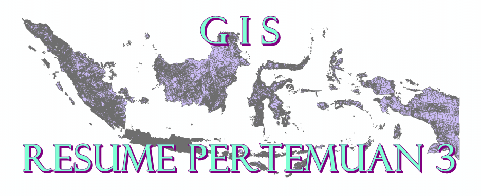

DATA VEKTOR GEOSPASIAL

  

1. LATAR BELAKANG MASALAH

Data spasial terbagi menjadi dua data yaitu data vektor dan data raster. Data vektor adalah data spasial yang berupa garis yang dihubungkan oleh titik / node dari awal sampai akhir. Kali ini data vektor akan dibahas lebih mendalam dalam postingan kali ini.

1. PEMBAHASAN

Data Vektor adalah sebuah data yang menggambarkan bumi secara jelas. Jelas yang dimaksud disini adalah bumi digambarkan oleh garis, titik, dan juga polygon.

Titik (node) adalah titik yang mewakili koordinat titik x dan y. biasanya melambangkan lokasi kota dan lokasi suatu tempat penting.

Garis (line) adalah sekumpulan dari titik – titik dan dihubungan dengan garis dengan tampilan memanjang, biasanya melambangkan loksi sungai, jalan raya, rel kereta api, dan lainnya.

Sementara Area (polygon) adalah suatu tempat yang terdapat pembatas untuk membatasai luas area tersebut. Biasanya melambangkan kawasan hutan, area cagar alam, lokasi terumbu karang, dan bisa juga area- area yang lainnya.

Data vektor mempunyai format, yaitu SHP (shapefile). Format SHP biasanya digunakan untuk menyimpan atribut, lokasi dan bentuk dari fitur geografis tersebut. Format SHP ini berisi tentang objek tunggal seperti jalan, sungai, kode pos, ataupun landmark.

Spesifikasi shapefile biasanya terdiri dari tiga ekstensi utama yaitu .shp, .shx, dan .dbf. .shp shape format untuk menimpan data feature geometry. .shx biasanya digunakan untuk memudahkan pencarian. Sementara .dbf berisi table attribute dari setiap feature.

Ukuran shape file tidak boleh melebihi 2GB. Dan ntuk panjang maksimum  dari sebuah nama field adalah 10 karakter, sementara jumlah maksimum dari field adalah 255 buah.

Method shapefile biasanya berguna untuk membaca data yang ada. Untuk yang dipergunakan oleh kami saat ini adalah Python.

1. PENUTUP

1. Kesimpulan        : data vektor yang memiliki format .shp atau yang biasa disebut shapefile ternyata memiliki ketentuan format, spesifikasi, ukuran dan method tersendiri yang sudah dibahas di bagian pembahasan.
2. Saran        : disarankan pembaca untuk mencari referensi dari link lain untuk pembahasan mengenai data vektor yang lebih lengkap.

