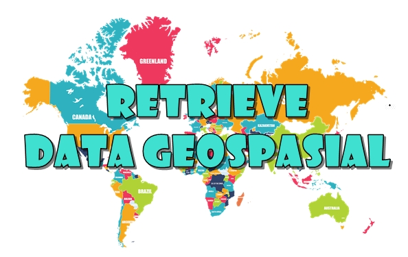

**RETRIEVE DATA GEOSPASIAL DATA**

  

**LATAR BELAKANG MASALAH**

Data spasial merupakan cara pandang melihat permukaan bumi lewat peta. Melalui software GIS kita dapat mengolah data spasial tersebut, salah satunya adalah Retrieve Data. Kali ini akan dibahas tentang retrieve data di dalam GIS.

**PEMBAHASAN**

**Pengertian**

Retrieve Data Geospasial yaitu cara pengambilan data geometris dan juga database dari data geospasial itu sendiri. Salah satu data yang diambil adalah data vector yang diketahui sebagai salah satu jenis data geospasial. Data vector memiliki format data shape yang berarti data tersebut di retrieve melalui python. SHP atau shapefile itu sendiri merupakan tempat penyimpanan data geometri. Sumber lain mengatakan, bahwa retrieve adalah manipulasi data untuk melihat isi data dari data vector tersebut.

**Syntak membaca jumlah data geometri**

&gt;&gt; import shapefile
&gt;&gt; sf = shapefile.Reader(&quot;namafile.shp&quot;)
&gt;&gt; sf.shapes()
&gt;&gt; a = sf.shapes()
&gt;&gt; print len(a)

**Syntak membaca data DBF**

DBF sendiri adalah file yang menyimpan data atribut dan dapat juga menyimpan file tabular.

&gt;&gt; import shapefile
&gt;&gt; sf.records()
&gt;&gt; sf.records(n)

**PENUTUP**

**Kesimpulan        :** Retrieve Data Geospasial adalah manipulasi data untuk melihat data geospasial. Bisa menggunakan aplikasi QGIS dengan menggunakan pyshp yang berbasis Python

**Saran                :** Disarankan untuk membaca sumber – sumber lain yang lebih rinci dan mendalam tentang retrieve data geospasial ini.

