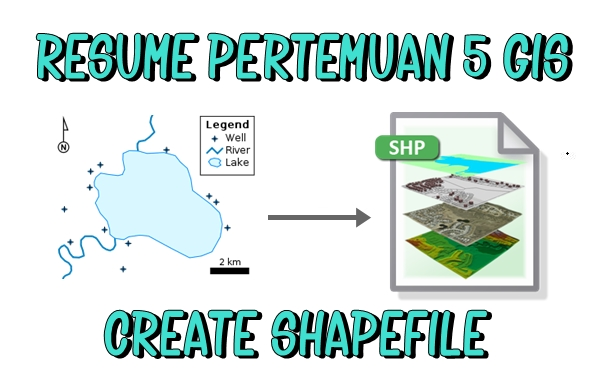

**CREATE SHAPEFILE**

  

**LATAR BELAKANG**

SHP atau shapefile adalah format dari file vektor. File vektor sendiri dibagi menjadi 4 jenis 4 jenis yaitu.shp, .dbf, .shx, dan .prj. isi dari shapefile sendiri adalah kode binary. Berikut akan dijelaskan mengenai cara membuat shapefile.

**PEMBAHASAN**

SHP merupakan salah satu jenis format file data vektor. Shapefile merupakan keluaran dari ESRI. ESRI sendiri merupakan perusahaan yang memproduksi software berbasis geografis. SHP juga yang paling banyak digunakan di dalam GIS.

Langkah – langkah create shapefile yaitu:

- --Menggunakan import pyshp dengan syntax &quot;import shapefile&quot;
- --Lalu instansiasi method writer dengan syntax &quot;a = shapefile writer()&quot;

Shapefile dibagi menjadi dua, yaitu:

- --File shp/geometri, biasanya di bagi menjadi 3 jenis yaitu: point, polyline, dan polygon.
- --Dbf yaitu berisi tabel identitas geometri

**Contoh point:**

Menambahkan record

Dengan memakai syntax &quot;a.point(x,y)&quot; atau &quot;a.point(x,y,o,o)

Dimana x dan y adalah koordinat longitude dan latitude

**Contoh polyline:**

Menggunakan syntax &quot;a.poly[shapetype=3, parts [[[x,y,z,w, [x2,y2,z2,w2]]]]&quot; atau &quot;a.poly [shapetype=5, parts[[[ ]],[ ]]]]&quot;

Dbf merupakan field untuk menemuka attribute table. Contohnya: syntax &quot;a.field(&#39;kota&#39;,&#39;c&#39;,&#39;30&#39;)&quot; maksudnya terdapat field kota dengan type char sebanyak 30. Lalu recordnya berisi syntax &quot;a.record (&#39;Jakarta&#39;)

**PENUTUP**

**Kesimpulan        :** Shapefile merupakan jenis data vektor. Dbf merupakan tabel identitas geometri. Cara membuat shapefile yaitu dengan cara import pyshp. Dan diberikan contoh contoh dari file shp tersebut.

**Saran        :** Disarankan untuk mencari dari sumber lain mengenai shapefile yang lebih lengkap dan lebih luas cakupannya.

