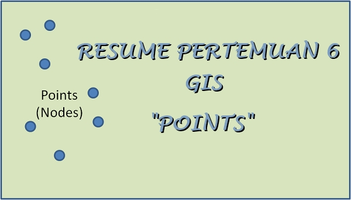

**CREATE POINT**

  

**LATAR BELAKANG MASALAH**

Data Vektor adalah data yang menggambarkan bumi secara jelas. Data Vektor digambarkan oleh point, polyline dan polygone. Berikut akan dijelaskan lebih dalam mengenai titik atau point.

**PEMBAHASAN**

Point adalah sebuah penggambaran bumi melalui titik. Titik – titik ini mewakili koordinat x dan y. Biasanya melambangkan sebuah lokasi seperti kota dan lokasi suatu tempat penting. Berikut ini adalah cara write, edit, delete, dan read record data point.

- **--**** Write Point**

w = shapeType

w.field (&#39;Kota&#39;,&#39;C&#39;,&#39;30&#39;)

w.field (&#39;Jakarta&#39;,&#39;Rima&#39;)

w.record (&#39;Jakarta&#39;,&#39;Rima&#39;)

w.point (10,10,0,0)

w.save(&#39;kota.shp&#39;)

exit()

- **--**** Edit Point**

e = shapefile.Editor(shapefile=&quot;shapefiles/test/point.shp&quot;)

e.point(0,0,10,2)

e.record(&quot;Appended&quot;,&quot;Point&quot;)

e.save(&#39;shapefiles/test/point&#39;)

- **--**** Delete Record**

e.delete(1)

- **--**** Read Point**

sf = shape

sf.records()

sf.record(0)

sf.record(1)

sf.shapes()[0].point

**PENUTUP**

1. **Kesimpulan        :** Point adalah sebuah penggambaran bumi melalui titik. Mewakili titik koordinat x dan y.
2. **Saran        :** Membutuhkan ketelitian untuk menempatkan point – point tersebut dalam sebuah peta

