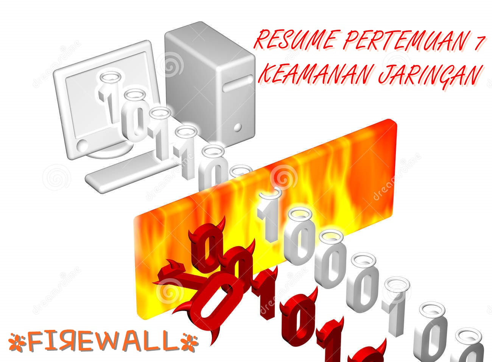

**FIREWALL**

  

LATAR BELAKANG

Keamanan jaringan sangat dibutuhkan yang sering kali diabaikan. Jaringan komputer juga perlu untuk melindungi data dari virus dan sebagainya. Salah satu perlindungan adalah firewall.

Firewall adalah sebuah perangkat dan sistem yang mengatur perizinan lalu lintas pada jaringan, jadi jaringan yang aman boleh melalui sedangkan yang tidak aman akan di block. Materi lebih lengkap tentang firewall akan dibahas pada bab pembahasan.

PEMBAHASAN

Pengertian Firewall

Firewall adalah suatu sistem yang berguna memproteksi atau melindungi lalu lintas pada paket data dari dan menuju sebuah jaringan pada komputer. Jadi paket data yang telah melalui firewall dapat diterima, ditolak, bahkan dimodifikasi dahulu sebelum meninggalkan jaringan.

Fungsi Firewall

- Melakukan autentifikasi
- Mengontrol dan mengatur lalu lintas sebuah jaringan
- Mengatur koneksi dan keadaan koneksi tersebut
- Melindungi sumber daya dalam jaringan privat
- Stateful Packet Inspection
- Mengatur proses inspeksi paket data

Kelebihan dan Kekurangan Firewall

- Kelebihan

- --Mudahnya router dalam memantau client
- --Bila terjadi kesalahan pada konfigurasi lebih mudah ditelusuri oleh firewall
- --Mudah untuk maintance dan pembaharuan
- --Pada perangkat jaringan biasa, firewall mudah diterapkan
- --Firewall dapat melakukan cek pada banyak koneksi dengan performa yang tinggi

- Kelemahan

- --Mudah ditembus dari luar
- --Mudah ditembus dari dalam

Tipe – Tipe Firewall

- Packet-Filter Firewall
- Application Level Firewall
- Circuit Level Gateway
- NAT (Network Address Translation) Firewall
- Virtual Firewall
- Stateful Firewall
- Transparent Firewall

Cara Kerja Firewall

Berdasarkan IP dan Port cara kerja firewall terdiri dari 3 kategori kerja, yaitu:

- Pass        : memperbolehkan paket data untuk melewati
- Drop        : melarang paket data untuk lewat, tetapi tidak memberi tahu pengirim bahwa paket tidak bisa lewat
- Block        : melarang paket untuk melewati, tetapi tetap memberi tahu pengirim bahwa paket data dilarang untuk lewat

PENUTUP

1. Kesimpulan : Firewall merupakan suatu sistem yang melindungi lalu lintas sebuah jaringan. Berfungsi untuk mengatur mana paket yang aman dan tidak, paket data yang aman lah yang boleh melalui firewall ini. Selain itu firewall juga memiliki kelebihan dan kekurangan. Dan cara kerjanya terdiri dari 3 yaitu pass, drop, dan block.
2. Saran : diharapkan dapat memahami lebih dalam tentang firewall ini.

