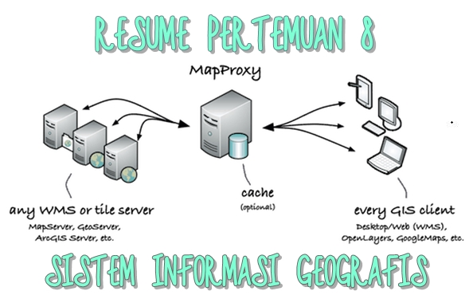

**KONFIGURASI MAPPROXY**

  

**LATAR BELAKANG**

Kali ini akan di bahas cara atau tutorial bagaimana mengkonfigurasikan MapProxy serta akan dijelaskan lebih mendalam tentang MapProxy.

**PEMBAHASAN**

**Pengertian MapProxy**

MapProxy atau mapproxy.org merupakan sebuah proxy opensource dari ubin geospasial yang mendukung proyeksi ulang. Dikembangkan oleh Omniscale. Jadi MapProxy adalah server proxy yang menampung dari hasil gambar geospasial. MapProxy dapat membaca data dari WMS, ubin, dll. Dan juga melayani data WMS, WMTS, TMS, dan KML. Hal ini juga yang melakukan reprojections antara berbagai sistem koordinat referensi.

**Install MapProxy**

- --Ketikkan &quot;#install python-pip dan python-dev&quot;
- --Kemudian &quot;#pip install mapproxy&quot;
- --Lalu &quot;#install Vwsqi&quot;
- --Setelah itu tunggu hingga selesai.

**Konfigurasi MapProxy**
_- mappproxy.yaml_
Adalah konfigurasi utama MapProxy. Gunanya mengkonfigurasi semua aspek server: Yang server harus dimulai, di mana berasal data dari, apa yang harus di-cache.
_- seed.yaml_
File ini mengkonfigurasi untuk alat mapproxy-benih.
- Konfigurasi MapProxy dikelompokkan menjadi beberapa bagian, masing-masing mengkonfigurasi aspek yang berbeda dari MapProxy. Ini adalah bagian berikut:

- --GLOBALS: Internal dari MapProxy dan nilai-nilai default yang digunakan dalam bagian konfigurasi lainnya.
- --Layanan: Layanan MapProxy penawaran, misalnya WMS atau TMS.
- --Sumber: Tentukan mana MapProxy dapat mengambil data baru.
- --Cache: Konfigurasi cache internal.
- --Lapisan: Konfigurasi lapisan yang MapProxy menawarkan. Setiap lapisan dapat terdiri dari beberapa sumber dan cache.
- --Grid: Tentukan grid yang menggunakan MapProxy untuk menyelaraskan gambar cache.

**Untuk memulai server tes**

_cd mymapproxy_
_mapproxy-util serve-develop mapproxy.yaml_

Sudah ada lapisan tes dikonfigurasi yang mendapatkan data dari Omniscale OpenStreetMap WMS. Jangan ragu untuk menggunakan layanan ini untuk pengujian.

MapProxy dilengkapi dengan layanan demo yang berisi daftar WMS semua dikonfigurasi dan lapisan TMS. Anda dapat mengakses layanan yang di _http: // localhost: 8080 / demo /._

**PENUTUP**

1. Kesimpulan : MapProxy adala server proxy yang berfungsi untuk menampung hasil gambar data geospasial. Konfigurasi MapProxy yang utama untuk mengkonfigurasi semua aspek.
2. Saran : Sebaiknya mencari referensi lain yang lebih lengkap dan langsung dipraktekkan untuk lebih memahami cara diatas.

