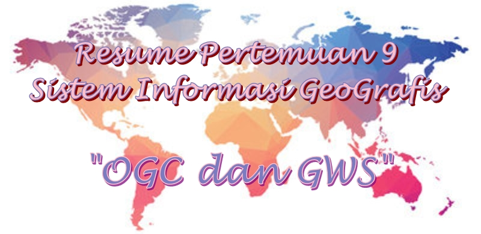
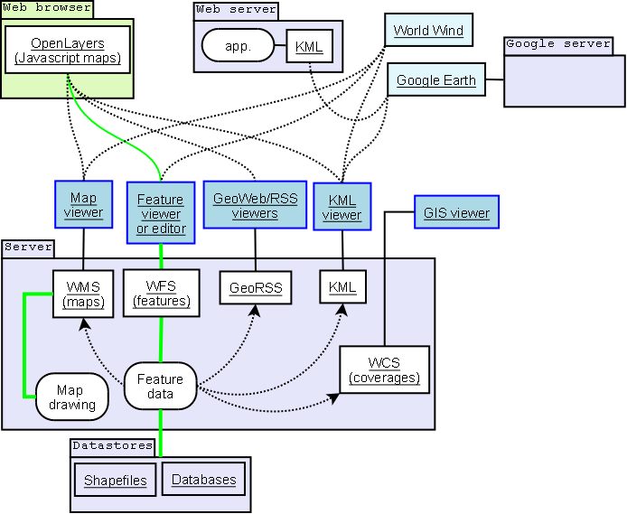

**Geospatial Web Services**

  

**LATAR BELAKANG**

Pada pertemuan GIS kali ini dibahas OGC dan GWS. OGC adalah kepanjangan dari Open Geospatial Consortium dan GWS adalah Geospatial Web Services. Keduanya akan dibahasa satu persatu lebih dalam lagi pada bab pembahasan. Akan dibahas mengenai definisi, arsitektur dan juga tipe – tipenya .

**PEMBAHASAN**

**Open Geospatial Consortium (OGC)**

- **--**** Definisi**

Merupakan sebuah konsorsium industry internasional yang bersiri tahun 1994 dibawahnya terdiri dari 500 perusahaan, organisasi penelitian, instansi pemerintahan, LSM dan universitas di seluruh dunia yang berkolaborasi dalam proses konsensus pengembangan dan penerapan standar untuk konten geospasial, Internet of Things, pengolahan data GIS dan data sharing.

- **--**** Arsitektur**

Kurang lebih arsitektur GOC seperti yang digambarkan gambar dibawah ini:

  

**Geospatial Web Service**

- **--**** Definisi**

Merupakan suatu teknologi yang paling sering digunakan untuk pertukaran data dan sharing data diantara stakeholder geospasial lainnya. Gunanya untuk membantu user menemukan, mengakses, dan memanipulasi data lokasi di web dinamis. GWS ini dirancang untuk membuat, memperbarui atau mengedit data secara real-time.

- **--**** Tipe – tipe**

1. Web Map Service (WMS)

WMS ini berguna untuk menyediakan layanan peta georeferensi kepada user melalui jaringan internet. Output WMS biasanya berupa format gambar seperti JPG, JPEG, dll. Yang apat ditampilkan melalui browser.

1. Web Coverage Service (WCS)

WCS menyediakan akses ke informasi melalui tiga operasi, yaitu GetCapabillities, DescribeCoverage, dan GetCoverage.

1. Web Feature Service

WFS berguna untuk memungkinkan user dapat mengakses dan memanipulasi informasi fitur geospasial dari jaringan terdistribusi.

**PENUTUP**

1. **Kesimpulan** : OGC atau Open Geospatial Consortioum adala organisasi besar yang mengatur standar format dataspasial, sedangkan GWS atau Geospatial Web Service adalah bagian dari GOC itu sendiri.
2. **Saran :** diharapkan postingan ini dapat membantu dan sebaiknya mencari referensi lainnya yang lebih lengkap membahas tentang materi ini.

